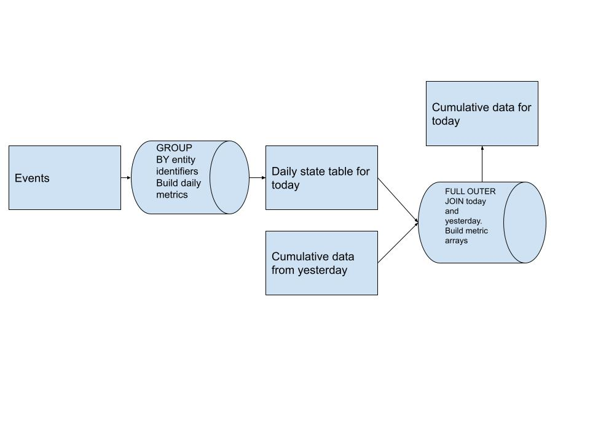

# Cumulative Table Design

Cumulative table design is an extremely powerful data engineering tool that all data engineers should know. 

This design produces tables that can provide efficient analyses on arbitrarily large (up to **thousands** of days) time frames

Here's a diagram of the high level pipeline design for this pattern:



We initially build our **daily** metrics table that is at the grain of whatever our entity is. This data is derived from whatever event sources we have upstream. 

After we have our daily metrics, we `FULL OUTER JOIN` yesterday's cumulative table with today's daily data and build our metric arrays for each user. This allows us to bring the new history in without having to scan all of it. **(a big performance boost)**

These metric arrays allow us to easily answer queries about the history of all users using things like `ARRAY_SUM` to calculate whatever metric we want on whatever time frame the array allows.

> The longer the time frame of your analysis, the more critical this pattern becomes!!

## Example User activity and engagement cumulated

> All query syntax is using Presto/Trino syntax and functions. This example would need to be modified for other SQL variants!
> 
> We'll be using the dates:
>  - **2022-01-01** as **today** in Airflow terms this is `{{ ds }}`
>  - **2021-12-31** as **yesterday** in Airflow templating terms this is `{{ yesterday_ds}}`


In this example, we'll be looking into how to build this design for calculate daily, weekly and monthly active users as well as the users likes, comments, and shares. 

Our source table in this case is **[events](tables/events.sql)**. 
- **A user is active on any given day if they generate an event for that day.**
- The table has `event_type` which is `like`, `comment`, `share`, or `view`

It's tempting to think the solution to this is running a pipeline something like
```
    SELECT 
        COUNT(DISTINCT user_id) as num_monthly_active_users,
        COUNT(CASE WHEN event_type = 'like' THEN 1 END) as num_likes_30d,
        COUNT(CASE WHEN event_type = 'comment' THEN 1 END) as num_comments_30d,
        COUNT(CASE WHEN event_type = 'share' THEN 1 END) as num_shares_30d,
        ...
    FROM events
    WHERE event_date BETWEEN DATE_SUB('2022-01-01', 30), AND '2022-01-01'
```

The problem with this is we're scanning 30 days of event data every day to produce these numbers. A pretty wasteful, yet simple pipeline. 
There should be a way where we only have to scan the event data once and combine with the results from the previous 29 days, right? Can we make a data structure where a data scientist can query our data and easily know the number of actions a user took in the last N number of days? 


This design is pretty simple with only 3 steps:

### The Daily table step
  - In this step we aggregate just the events of today to see who is daily active. The table schema is [here](tables/active_users_daily.sql)
  - This query is pretty simple and straight forward [here](queries/active_users_daily_populate.sql)
    - `GROUP BY user_id` and then count them as daily active if they have any events
    - we add a few `COUNT(CASE WHEN event_type = 'like' THEN 1 END)` statements to figure out the number of daily likes, comments, and shares as well
### The Cumulation step
  - The table schema for this step is [here](tables/active_users_cumulated.sql)
  - The query for this step is much more complex. It's [here](queries/active_users_cumulated_populate.sql)
    - This step we take **today's** data from the daily table and **yesterday's** data from the cumulated table
    - We `FULL OUTER JOIN` these two data sets on `today.user_id = yesterday.user_id`
    - If a user is brand new, they won't be in yesterday's data also if a user wasn't active today, they aren't in today's data
    - So we need to `COALESCE(today.user_id, yesterday.user_id) as user_id` to keep track of all the users
    - Next we want to build the `activity_array` column. We only want `activity_array` to store the data of the last 30 days
      - So we check to see if `CARDINALITY(activity_array) < 30` to understand if we can just add today's value to the front of the array or do we need to slice an element off the end of the array before adding today's value to the front
      - We need to perform `COALESCE(t.is_active_today, 0)` to put zero values into the array when a user isn't active
    - We follow a very similar pattern to how we built `activity_array` but for likes, comments, and shares as well!
    - After we build all our metric arrays, calculating weekly and monthly activity is pretty straight forward
      - `CASE WHEN ARRAY_SUM(activity_array) > 0 THEN 1 ELSE 0 END` gives us monthly actives since we limit the array size to 30
      - `CASE WHEN ARRAY_SUM(SLICE(activity_array, 1, 7)) > 0 THEN 1 ELSE 0 END` gives us weekly active since we only check the first 7 elements of the array *(i.e. the last 7 days)*
    - Summing the number of likes, comments, and shares in the past 7 days is also easy
      - `ARRAY_SUM(SLICE(like_array, 1, 7)) as num_likes_7d` gives us the number of likes this user did in the past 7 days
      - `ARRAY_SUM(like_array) as num_likes_30d` gives us the number of likes this user did in the past 30 days since the array is fixed to that size
### The DAG step
  - The example DAG can be found [here](cumulative_table_dag.py)
  - Key things to remember for the DAG are:
    - Cumulative DAGs should always be `depends_on_past: True`
    - The Daily aggregation step needs to be upstream of the cumulation step